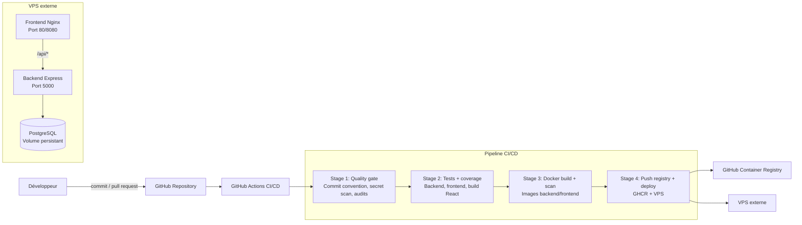

# Metrics App - Projet CI/CD

Application support utilisée pour démontrer une chaîne CI/CD complète autour d'une petite plateforme de suivi de métriques.

L'application reste volontairement simple : l'évaluation porte principalement sur la gestion du cycle de vie logiciel, les tests automatisés, la qualité, la conteneurisation, la publication des images et le déploiement externe.

## Stack technique

| Couche | Technologie | Rôle |
|---|---|---|
| Frontend | React 18 + Nginx | Interface de saisie et visualisation des métriques |
| Backend | Node.js 20 + Express | API REST `/api/metrics` et endpoint de santé `/api/health` |
| Base de données | PostgreSQL 15 | Persistance des métriques |
| Conteneurisation | Docker + Docker Compose | Build local, orchestration et déploiement VPS |
| CI/CD | GitHub Actions | Quality gate, tests, build Docker, scan, push registry et déploiement |
| Registry | GitHub Container Registry | Stockage des images applicatives |

## Architecture technique



## Fonctionnalités applicatives utiles pour la CI/CD

- API REST testable avec `supertest`.
- Endpoint `/api/health` utilisé par les healthchecks Docker.
- Validation stricte des entrées API : valeur finie et timestamp exploitable.
- Frontend testé avec React Testing Library.
- Couverture de code mesurée et bloquante via seuils Jest.
- Configuration Docker compatible local et production.

## Lancement local avec Docker Compose

Créer le fichier d'environnement local :

```bash
cp .env.example .env
```

Adapter les valeurs dans `.env`, puis lancer :

```bash
docker compose up --build
```

Services disponibles :

- Frontend : `http://localhost:8080`
- Backend healthcheck : `http://localhost:5000/api/health`
- Backend API : `http://localhost:5000/api/metrics`

## Lancement local hors Docker

Backend :

```bash
cd backend
npm ci
npm run check
npm run test:coverage
npm start
```

Frontend :

```bash
cd frontend
npm install --ignore-scripts
npm run test:coverage
GENERATE_SOURCEMAP=false npm run build
npm start
```

## Pipeline CI/CD

Le workflow `.github/workflows/ci-cd.yml` est déclenché automatiquement sur :

- `pull_request` vers `main` ou `develop` ;
- `push` vers `main` ou `develop`.

Aucun déclenchement manuel n'est requis pour la démonstration.

### Stage 1 - Quality gate

Objectif : bloquer tôt les changements risqués.

Sous-étapes :

1. validation des conventions de commit sur les pull requests ;
2. scan de secrets avec Gitleaks ;
3. installation contrôlée par `package-lock.json` ;
4. vérification syntaxique backend ;
5. audit des dépendances critiques.

### Stage 2 - Automated tests and coverage

Objectif : prouver la non-régression applicative.

Sous-étapes :

1. tests unitaires backend avec couverture ;
2. tests frontend avec couverture ;
3. build de production React ;
4. publication des rapports de couverture en artifacts.

Seuils configurés :

- backend : 80 % statements, branches, functions, lines ;
- frontend : 70 % statements, branches, functions, lines.

### Stage 3 - Docker build and image scan

Objectif : vérifier que les images applicatives sont constructibles et suffisamment sûres.

Sous-étapes :

1. build image backend ;
2. build image frontend ;
3. scan Trivy backend ;
4. scan Trivy frontend.

Le scan bloque sur les vulnérabilités critiques. Les vulnérabilités high sont documentées comme dette technique afin de conserver un gate réaliste pour le POC.

### Stage 4 - Publish images and deploy

Objectif : produire un livrable déployable et pousser automatiquement vers un environnement externe.

Sous-étapes :

1. authentification au GitHub Container Registry ;
2. build et push image backend ;
3. build et push image frontend ;
4. copie des fichiers de déploiement sur VPS ;
5. lancement de `docker compose pull` puis `docker compose up -d` sur le serveur.

Ce stage s'exécute uniquement après un `push` sur `main`.

## Secrets GitHub Actions attendus

Configurer dans `Settings > Secrets and variables > Actions` :

| Secret | Utilisation |
|---|---|
| `VPS_HOST` | Adresse IP ou DNS du VPS |
| `VPS_USER` | Utilisateur SSH du VPS |
| `VPS_SSH_KEY` | Clé privée SSH autorisée sur le VPS |
| `POSTGRES_USER` | Utilisateur PostgreSQL de production |
| `POSTGRES_PASSWORD` | Mot de passe PostgreSQL de production |
| `POSTGRES_DB` | Nom de la base PostgreSQL |
| `CORS_ORIGIN` | Origine autorisée pour le backend, par exemple `https://metrics.example.com` |
| `FRONTEND_PORT` | Port exposé côté serveur, par exemple `80` |

Les secrets réels restent hors du dépôt. Le fichier `.env.example` fournit uniquement un modèle local.

## Préparation du VPS

Pré-requis sur le serveur externe :

```bash
sudo apt-get update
sudo apt-get install -y docker.io docker-compose-plugin
sudo mkdir -p /opt/metrics-app
sudo chown "$USER":"$USER" /opt/metrics-app
```

Ajouter la clé publique SSH du compte GitHub Actions dans `~/.ssh/authorized_keys` de l'utilisateur de déploiement.

Le workflow copie automatiquement :

- `docker-compose.prod.yml` ;
- `deploy-vps.sh` ;
- le fichier `.env` généré depuis les secrets GitHub.

## Politique Git et conventions

La politique est détaillée dans `docs/git-policy.md`.

Résumé :

- `main` représente l'état production ;
- `develop` représente l'intégration continue ;
- les changements passent par pull request ;
- les commits suivent Conventional Commits : `feat(api): add health endpoint`, `fix(ci): repair docker port`, `docs(readme): explain deployment` ;
- la fusion est validée lorsque les stages de CI/CD sont verts.

## Sécurité

Mesures présentes :

- aucune valeur sensible réelle dans les fichiers versionnés ;
- configuration par variables d'environnement ;
- scan de secrets dans la pipeline ;
- healthchecks backend, frontend et base de données ;
- backend exécuté en utilisateur non-root dans l'image Docker ;
- headers de sécurité Nginx ;
- audit de dépendances critiques.

## Choix techniques justifiables à l'oral

- GitHub Actions : cohérent avec un dépôt GitHub, lisible, rapide à démontrer, intégration native avec GHCR.
- Docker Compose en production VPS : suffisant pour une application trois services, plus simple à maintenir qu'un cluster Kubernetes pour ce besoin.
- Kubernetes et Terraform écartés pour le POC : surdimensionnés pour une application support simple, tout en restant envisageables si l'application doit être répliquée, autoscalée ou industrialisée multi-environnements.
- Seuils de couverture progressifs : les seuils bloquent la régression, tout en restant atteignables pour le périmètre académique.
- Trivy et Gitleaks : ajoutent un contrôle sécurité concret dans la pipeline sans complexifier l'architecture.

## Démonstration orale recommandée

1. Ouvrir le README et expliquer l'architecture.
2. Montrer la politique de branches et la convention de commit.
3. Créer une pull request avec un petit changement de documentation ou de test.
4. Montrer les stages 1 à 3 sur la PR.
5. Merger sur `main` ou pousser un commit préparé sur `main`.
6. Montrer le stage 4 : push GHCR et déploiement VPS.
7. Ouvrir l'application depuis l'URL du VPS.
8. Ouvrir `/api/health` pour prouver que le backend répond.
