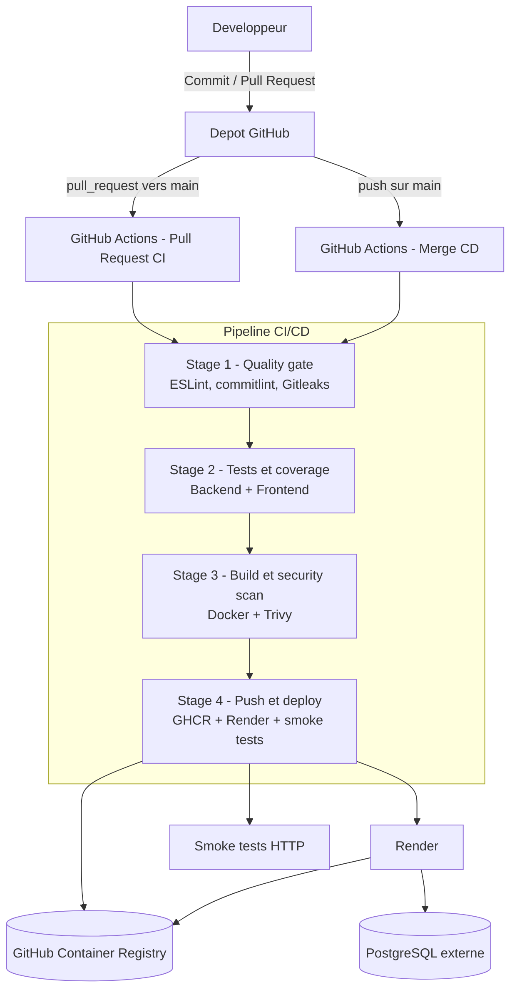

# Ynov CI/CD - Projet Final

Application de suivi de métriques composée de trois blocs :

- un backend Node.js / Express ;
- un frontend React servi par Nginx ;
- une base PostgreSQL.

Le projet est conteneurisé avec Docker, testé automatiquement avec GitHub Actions, publié dans GitHub Container Registry et déployé sur Render après validation complète de la pipeline.

---

## 1. Architecture DevOps



### Choix techniques

| Bloc                  | Choix                           | Justification                                                                                             |
| --------------------- | ------------------------------- | --------------------------------------------------------------------------------------------------------- |
| Gestion de code       | GitHub                          | Dépôt centralisé, Pull Requests, protection de branche et historique de commits.                          |
| CI/CD                 | GitHub Actions                  | Intégration native avec GitHub, workflows déclaratifs en YAML, déclenchement automatique sur PR et merge. |
| Registry Docker       | GitHub Container Registry       | Registry lié au dépôt, traçabilité des images par tags `sha` et `latest`.                                 |
| Hébergement           | Render                          | Environnement externe, compatible Docker, déploiement par deploy hook.                                    |
| Base de données       | PostgreSQL Render ou équivalent | Base externe séparée du poste local et des conteneurs applicatifs.                                        |
| Sécurité              | Gitleaks + Trivy                | Détection de secrets dans le dépôt et scan de vulnérabilités sur les images Docker.                       |
| Validation production | Smoke tests HTTP                | Vérification automatique que le backend et le frontend répondent après déploiement.                       |

---

## 2. Structure du projet

```text
.
├── .github/
│   ├── pull_request_template.md
│   └── workflows/
│       ├── pull_request.yml
│       └── merge.yml
├── backend/
│   ├── Dockerfile
│   ├── app.js
│   ├── db.js
│   ├── index.js
│   ├── app.test.js
│   ├── db.test.js
│   └── package.json
├── frontend/
│   ├── Dockerfile
│   ├── nginx.conf
│   ├── src/
│   └── package.json
├── docker-compose.yml
├── .env.example
├── .gitignore
├── commitlint.config.cjs
└── README.md
```

---

## 3. Lancement local

### Prérequis

- Node.js 20 ou version compatible avec le projet ;
- npm ;
- Docker ;
- Docker Compose.

### Configuration locale

Créer un fichier `.env` local depuis le modèle :

```bash
cp .env.example .env
```

Exemple de variables pour le développement local :

```env
POSTGRES_USER=metrics_app
POSTGRES_PASSWORD=change-me-with-a-local-password
POSTGRES_DB=metrics
BACKEND_PORT=5000
FRONTEND_PORT=8080
CORS_ORIGIN=*
```

Le fichier `.env` sert uniquement au poste local. Il doit rester exclu du dépôt Git.

### Démarrer l'application avec Docker Compose

```bash
docker compose down
docker compose up -d --build
```

Services locaux :

| Service             | URL locale                          |
| ------------------- | ----------------------------------- |
| Frontend            | `http://localhost`                  |
| Backend healthcheck | `http://localhost:5000/api/health`  |
| Backend API metrics | `http://localhost:5000/api/metrics` |
| PostgreSQL          | `localhost:5432`                    |

### Arrêter l'environnement local

```bash
docker compose down
```

Pour supprimer aussi le volume PostgreSQL local :

```bash
docker compose down -v
```

---

## 4. Tests et qualité en local

### Backend

```bash
cd backend
npm ci
npm test -- --coverage
npx eslint .
```

Le backend utilise Jest, Supertest et ESLint. La couverture est configurée dans `backend/package.json` avec un seuil minimal de 95 %.

### Frontend

```bash
cd frontend
npm ci
CI=true npm test -- --coverage
npx eslint src/
```

Le frontend utilise React Testing Library et la configuration ESLint fournie par React.

### Build Docker local

Depuis la racine du projet :

```bash
docker build -t metrics-backend:local ./backend
docker build -t metrics-frontend:local ./frontend
```

---

## 5. Politique Git

La branche principale du projet est `main`.

Règles attendues :

1. travailler sur une branche dédiée ;
2. ouvrir une Pull Request vers `main` ;
3. attendre la réussite des checks GitHub Actions ;
4. relire la checklist de Pull Request ;
5. merger uniquement lorsque la pipeline est verte.

### Convention de commits

Les commits suivent la convention Conventional Commits.

Exemples :

```text
feat: add healthcheck endpoint
fix: update backend docker image
ci: add trivy scan
chore: update documentation
```

La convention est contrôlée par `commitlint` dans la pipeline.

### Protection de branche recommandée

Dans GitHub, configurer `main` avec :

- Pull Request obligatoire ;
- checks GitHub Actions obligatoires ;
- blocage du push direct ;
- historique de pipeline conservé pour la soutenance.

---

## 6. Pipeline CI/CD

Le projet contient deux workflows GitHub Actions.

| Workflow                             | Déclencheur              | Rôle                                                                                                       |
| ------------------------------------ | ------------------------ | ---------------------------------------------------------------------------------------------------------- |
| `.github/workflows/pull_request.yml` | Pull Request vers `main` | Valider la qualité, les tests, le coverage, le build Docker et le scan sécurité avant merge.               |
| `.github/workflows/merge.yml`        | Push sur `main`          | Rejouer la validation, publier les images Docker dans GHCR, déclencher Render et exécuter les smoke tests. |

### Stage 1 - Quality gate

Objectif : bloquer les changements non conformes avant les étapes longues.

Étapes :

- checkout du dépôt ;
- installation des dépendances nécessaires ;
- lint frontend avec ESLint ;
- lint backend avec ESLint ;
- vérification des messages de commit avec commitlint ;
- scan de secrets avec Gitleaks.

Condition de passage : lint valide, convention de commits respectée et aucun secret détecté.

### Stage 2 - Tests et coverage

Objectif : vérifier automatiquement le comportement du backend et du frontend.

Étapes :

- installation des dépendances backend ;
- lancement des tests backend avec coverage ;
- publication de l'artefact `backend/coverage` ;
- installation des dépendances frontend ;
- lancement des tests frontend avec coverage ;
- publication de l'artefact `frontend/coverage`.

Les tests sont exécutés sur plusieurs systèmes : Ubuntu, macOS et Windows.

Condition de passage : tests verts et seuils de couverture respectés.

### Stage 3 - Build et security scan

Objectif : garantir que les images Docker sont constructibles et suffisamment propres pour être publiées.

Étapes :

- activation de Docker Buildx ;
- build de l'image backend ;
- build de l'image frontend ;
- scan des images avec Trivy.

La pipeline échoue si Trivy détecte une vulnérabilité `HIGH` ou `CRITICAL` non ignorée par la stratégie du workflow.

### Stage 4 - Push et deploy

Objectif : publier les images validées et déployer l'application sur un environnement externe.

Étapes :

- login vers GHCR avec `GITHUB_TOKEN` ;
- push des images backend et frontend ;
- tags Docker générés automatiquement : `latest` et `sha` ;
- appel des deploy hooks Render ;
- attente du redéploiement ;
- smoke test backend sur `/api/health` ;
- smoke test frontend sur l'URL publique.

Le stage de déploiement s'exécute uniquement sur `main`.

---

## 7. Images Docker et GHCR

Les images sont publiées dans GitHub Container Registry avec un nom basé sur le dépôt GitHub.

Format attendu :

```text
ghcr.io/<owner>/<repository>-backend:latest
ghcr.io/<owner>/<repository>-backend:sha-<commit>
ghcr.io/<owner>/<repository>-frontend:latest
ghcr.io/<owner>/<repository>-frontend:sha-<commit>
```

Les tags `sha` permettent de retrouver précisément l'image produite par un commit donné. Le tag `latest` sert à pointer la dernière version stable de la branche `main`.

---

## 8. Secrets GitHub Actions

Configurer les secrets dans :

```text
GitHub > Repository > Settings > Secrets and variables > Actions
```

| Secret                 | Utilisation                                          |
| ---------------------- | ---------------------------------------------------- |
| `RENDER_HOOK_BACKEND`  | Deploy hook Render du service backend.               |
| `RENDER_HOOK_FRONTEND` | Deploy hook Render du service frontend.              |
| `PROD_BACKEND_URL`     | URL publique du backend utilisée par le smoke test.  |
| `PROD_FRONTEND_URL`    | URL publique du frontend utilisée par le smoke test. |

`GITHUB_TOKEN` est fourni automatiquement par GitHub Actions. Il sert au login GHCR et au push des images, avec la permission `packages: write` définie dans le workflow.

Les secrets ne doivent jamais être commités dans le dépôt, affichés dans le README ou copiés dans les logs.

---

## 9. Variables Render

### Backend Render

Variables recommandées pour le service backend :

| Variable              | Rôle                                                       |
| --------------------- | ---------------------------------------------------------- |
| `NODE_ENV=production` | Active le mode production.                                 |
| `PORT`                | Port d'écoute fourni par Render ou défini dans le service. |
| `DATABASE_URL`        | Connexion à PostgreSQL.                                    |
| `CORS_ORIGIN`         | Origine frontend autorisée à appeler l'API.                |

Le backend accepte aussi une configuration PostgreSQL détaillée avec `POSTGRES_HOST`, `POSTGRES_USER`, `POSTGRES_PASSWORD`, `POSTGRES_DB` et `POSTGRES_PORT`, mais `DATABASE_URL` reste le format le plus adapté pour Render.

### Frontend Render

Le frontend est servi par Nginx et proxifie les appels `/api` vers le backend.

| Variable        | Rôle                                                                                     |
| --------------- | ---------------------------------------------------------------------------------------- |
| `PROXY_API_URL` | URL interne ou publique du backend Render, par exemple `https://<backend>.onrender.com`. |

Si le frontend est déployé comme site statique hors image Nginx, utiliser plutôt une variable de build React comme `REACT_APP_API_URL` pointant vers l'URL publique du backend.

---

## 10. Déploiement Render

### Backend

1. Créer un service web Render basé sur une image Docker existante.
2. Sélectionner l'image GHCR backend.
3. Configurer les variables d'environnement backend.
4. Relier le service à PostgreSQL via `DATABASE_URL`.
5. Créer un deploy hook Render.
6. Copier le deploy hook dans le secret GitHub `RENDER_HOOK_BACKEND`.

### Frontend

1. Créer un service web Render basé sur l'image Docker frontend.
2. Sélectionner l'image GHCR frontend.
3. Configurer `PROXY_API_URL` vers l'URL du backend Render.
4. Créer un deploy hook Render.
5. Copier le deploy hook dans le secret GitHub `RENDER_HOOK_FRONTEND`.

### Orchestration attendue

Render ne doit pas piloter directement le déploiement depuis Git. GitHub Actions reste l'orchestrateur principal :

```text
merge vers main -> tests -> coverage -> build Docker -> scan Trivy -> push GHCR -> deploy hooks Render -> smoke tests
```

---

## 11. Endpoints utiles

| Endpoint            | Description                                                 |
| ------------------- | ----------------------------------------------------------- |
| `GET /api/health`   | Vérifie que le backend répond. Utilisé par les smoke tests. |
| `GET /api/metrics`  | Liste les métriques enregistrées.                           |
| `POST /api/metrics` | Ajoute une métrique avec `value` et `timestamp`.            |

Exemple de test manuel :

```bash
curl -fsS http://localhost:5000/api/health
curl -fsS http://localhost:5000/api/metrics
```

---

## 12. Sécurité et qualité

Mesures présentes dans le projet :

- `.env` exclu du dépôt ;
- `.env.example` présent pour documenter les variables ;
- Gitleaks dans la pipeline ;
- Trivy sur les images Docker ;
- lint backend et frontend ;
- commitlint ;
- coverage backend et frontend ;
- artefacts de coverage dans GitHub Actions ;
- smoke tests après déploiement.

Vérification locale utile avant rendu :

```bash
git ls-files | grep -E "(\.env|node_modules|coverage)"
```

Cette commande doit retourner une sortie vide pour un dépôt propre.

---

## 13. Rollback

Deux stratégies sont prévues.

### Option A - Revert Git

Revenir sur le commit fautif :

```bash
git revert <sha-du-commit>
git push origin main
```

La pipeline rejoue les tests, reconstruit les images, pousse une nouvelle version GHCR et redéploie Render.

### Option B - Redéploiement d'une image stable

Depuis Render, repointer temporairement le service vers une image GHCR précédente :

```text
ghcr.io/<owner>/<repository>-backend:sha-<commit-stable>
ghcr.io/<owner>/<repository>-frontend:sha-<commit-stable>
```

Cette option permet de revenir rapidement à une version déjà validée par la pipeline.

---

## 14. Preuves à présenter en soutenance

Préparer les éléments suivants avant la démonstration :

| Preuve                   | Élément attendu                                                               |
| ------------------------ | ----------------------------------------------------------------------------- |
| Pull Request verte       | Checks PR au vert avec quality gate, tests, coverage, build et scan.          |
| Pipeline `main` complète | Exécution GitHub Actions après merge avec les 4 stages visibles.              |
| Artefacts coverage       | Rapports backend et frontend accessibles dans GitHub Actions.                 |
| Logs Gitleaks            | Scan terminé sans secret détecté.                                             |
| Logs Trivy               | Images backend et frontend scannées sans vulnérabilité bloquante.             |
| GHCR                     | Images publiées avec tags `latest` et `sha`.                                  |
| Render backend           | URL publique backend et réponse de `/api/health`.                             |
| Render frontend          | URL publique frontend accessible.                                             |
| Secrets                  | Capture montrant les noms de secrets GitHub/Render sans afficher les valeurs. |
| Rollback                 | Procédure documentée et explicable rapidement.                                |

---

## 15. Scénario de démonstration conseillé

1. Ouvrir GitHub Actions, une Pull Request de démonstration, GHCR et Render.
2. Faire une petite modification documentaire sur une branche dédiée.
3. Ouvrir une Pull Request vers `main`.
4. Montrer le déclenchement automatique du workflow Pull Request CI.
5. Présenter les stages : quality gate, tests/coverage, build/scan.
6. Merger vers `main` lorsque la PR est verte.
7. Montrer le workflow Merge CD : push GHCR, deploy Render, smoke tests.
8. Ouvrir l'URL publique frontend.
9. Ouvrir l'URL backend `/api/health`.
10. Montrer les images GHCR avec les tags générés.

Prévoir une exécution réussie récente ouverte dans un onglet comme plan de secours.

---

## 16. Dépannage rapide

### Trivy échoue sur l'image backend ou frontend

Actions possibles :

- mettre à jour l'image de base Docker ;
- reconstruire l'image ;
- vérifier les vulnérabilités restantes dans les logs ;
- documenter les vulnérabilités non corrigeables si elles sont explicitement acceptées.

### Render retourne une erreur 502 ou 503

Vérifier :

- les logs Render ;
- la variable `PORT` côté backend ;
- `DATABASE_URL` côté backend ;
- `PROXY_API_URL` côté frontend ;
- l'accessibilité de `/api/health`.

### Le frontend ne contacte pas le backend

Vérifier :

- `PROXY_API_URL` dans Render ;
- la configuration Nginx ;
- `CORS_ORIGIN` côté backend ;
- l'URL appelée dans l'onglet Network du navigateur.

### Les smoke tests échouent

Vérifier :

- `PROD_BACKEND_URL` ;
- `PROD_FRONTEND_URL` ;
- le temps de redémarrage Render ;
- les logs du workflow GitHub Actions.

---

## 17. Commandes utiles

```bash
# Voir les fichiers suivis qui ne devraient pas l'être
git ls-files | grep -E "(\.env|node_modules|coverage)"

# Lancer l'application localement
docker compose up -d --build

# Tester le backend local
curl -fsS http://localhost:5000/api/health

# Tests backend
cd backend && npm ci && npm test -- --coverage && npx eslint .

# Tests frontend
cd frontend && npm ci && CI=true npm test -- --coverage && npx eslint src/

# Builds Docker
docker build -t metrics-backend:local ./backend
docker build -t metrics-frontend:local ./frontend
```

---

## 18. État attendu avant rendu

Le projet est prêt pour l'évaluation lorsque :

- une Pull Request déclenche automatiquement la CI ;
- un merge sur `main` déclenche la CI/CD complète ;
- les 4 stages sont visibles dans GitHub Actions ;
- les tests backend et frontend passent ;
- les rapports de coverage sont disponibles ;
- les images Docker sont publiées dans GHCR ;
- Render redéploie l'application depuis les images GHCR ;
- les smoke tests valident le backend et le frontend ;
- le dépôt ne contient aucun secret ;
- la procédure de rollback est documentée ;
- les preuves de soutenance sont préparées.
