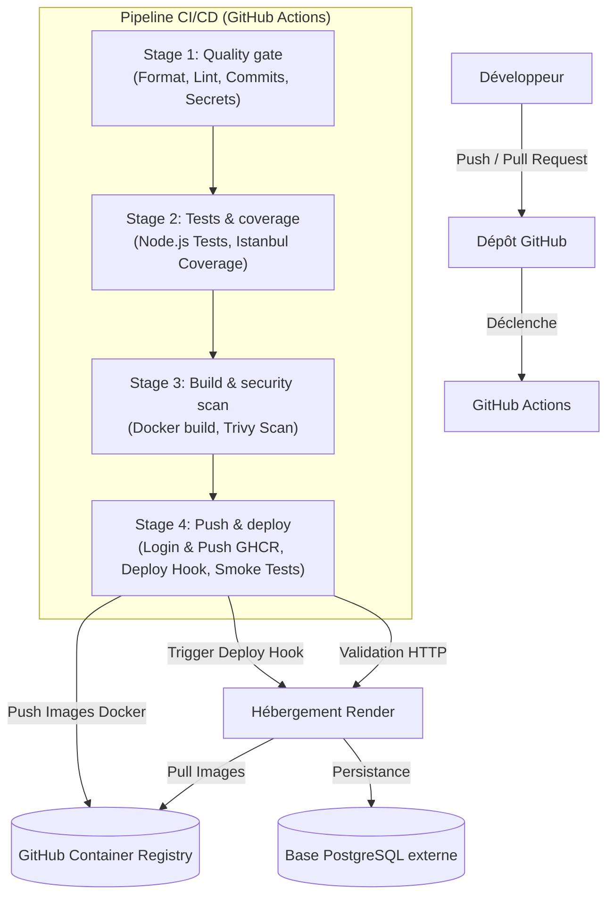

# Ynov CI/CD - Projet Final

Ce projet contient une application complète avec un backend en Node.js (Express), un frontend en React, et une base de données PostgreSQL. Le tout est orchestré avec Docker Compose pour le développement local et déployé via une pipeline de CI/CD automatisée avec GitHub Actions, GitHub Container Registry (GHCR) et Render.

---

## 🛠️ Architecture DevOps

Le projet s'appuie sur une architecture cloud moderne, découplée et sécurisée. Ci-dessous le flux de travail et l'intégration des différents services :



### Choix techniques & Justifications
- **GitHub Actions** : Intégré nativement au dépôt de code, déclaratif en YAML, et hautement disponible, évitant l'administration d'un serveur Jenkins complexe.
- **GitHub Container Registry (GHCR)** : Lié directement au dépôt GitHub, il offre une traçabilité optimale des versions d'images Docker associées aux commits.
- **Render** : Permet un hébergement externe et un déploiement continu à l'aide de webhooks après la validation complète des étapes CI.
- **PostgreSQL Externe** : Base managée pour assurer la persistance des données indépendamment du cycle de vie des conteneurs applicatifs.
- **Smoke Tests** : Vérification post-déploiement automatisée par requêtes HTTP pour garantir la disponibilité réelle du site en production.

---

## 💻 Setup Local

Pour lancer et valider les modifications localement sur votre poste :

### 1. Démarrer l'environnement Docker local
```bash
# Arrêter les conteneurs existants et reconstruire les images avec les modifications
docker compose down
docker compose up -d --build
```

### 2. Exécuter les tests unitaires locaux
- **Backend :**
  ```bash
  cd backend && npm test
  ```
- **Frontend :**
  ```bash
  cd frontend && npm test
  ```

---

## 🤖 Pipeline CI/CD

La pipeline GitHub Actions est structurée en 4 étapes majeures visibles :

### **Stage 1 : Quality gate**
- **Objectif** : Bloquer les changements non conformes avant de lancer les builds lourds.
- **Actions** : Linting ESLint du frontend, vérification des conventions de messages de commit (`commitlint`), et détection de secrets sensibles dans le code source (`gitleaks`).

### **Stage 2 : Tests & coverage**
- **Objectif** : Prouver le bon fonctionnement fonctionnel de l'application et mesurer la couverture de code.
- **Actions** : Lancement des suites de tests unitaires sur différentes plateformes (Ubuntu, macOS, Windows) et publication des rapports de couverture de code (seuil minimal requis).

### **Stage 3 : Build & security scan**
- **Objectif** : Valider la conformité sécuritaire des conteneurs avant publication.
- **Actions** : Construction locale des images Docker et analyse des failles avec **Trivy**. La pipeline échoue (`exit-code: 1`) si une vulnérabilité de sévérité `CRITICAL` ou `HIGH` est identifiée.

### **Stage 4 : Push & deploy**
- **Objectif** : Publier les images stables et mettre à jour la production.
- **Actions** : Authentification sur GHCR, push des images taggées (`latest` + `sha`), appel du Deploy Hook de Render, attente de démarrage et validation finale par **smoke tests HTTP**.

---

## 🔑 Secrets nécessaires (GitHub Actions)

Pour faire fonctionner la pipeline CD sur la branche `main`, configurez les secrets suivants dans les paramètres de votre dépôt GitHub (`Settings > Secrets and variables > Actions`) :

| Secret | Rôle / Utilisation |
| :--- | :--- |
| `RENDER_HOOK_BACKEND` | URL du Deploy Hook fourni par Render pour le service Backend |
| `RENDER_HOOK_FRONTEND` | URL du Deploy Hook fourni par Render pour le service Frontend |
| `PROD_BACKEND_URL` | URL publique du Backend déployé pour le Smoke Test (`/api/metrics`) |
| `PROD_FRONTEND_URL` | URL publique du Frontend pour le Smoke Test d'accès UI |
| `DATABASE_URL` | Chaîne de connexion PostgreSQL configurée sur l'environnement Render |

---

## 🚀 Déploiement sur Render

1. Créer un service web **Render** pour le backend et le frontend en sélectionnant un déploiement basé sur une image Docker existante.
2. Renseigner l'URI de l'image GHCR correspondante (ex: `ghcr.io/<username>/ynov-cicd-final-backend:latest`).
3. Désactiver l'auto-déploiement sur Render (Auto-Deploy: `No`) pour laisser GitHub Actions orchestres les releases.
4. Ajouter les variables d'environnement de production sur Render (`DATABASE_URL`, `CORS_ORIGIN`, `NODE_ENV`).
5. Copier les deploy webhooks de Render et les ajouter comme secrets dans le dépôt GitHub.

---

## 🔄 Procédure de Rollback (Retour arrière)

En cas d'anomalie détectée en production après un déploiement :
1. **Option A (Revert Git)** : Effectuer un `git revert` du commit défaillant sur la branche `main` et pousser le changement. La pipeline automatisée exécutera à nouveau tous les tests, publiera la nouvelle image stable et écrasera la version défectueuse en production.
2. **Option B (Déploiement manuel via tag d'image)** : Se connecter sur l'interface Render, modifier temporairement le tag de l'image Docker pour pointer vers un tag SHA précédent connu comme stable (ex: `ghcr.io/<username>/ynov-cicd-final-backend:sha-<commit_stable>`), et déclencher un déploiement manuel.

---

## 📋 Preuves pour l'évaluation

Les éléments suivants doivent être présentés ou collectés pour valider les critères de notation :
1. **Pull Request verte** : Une PR ouverte avec l'ensemble des validations des stages 1, 2 et 3 au vert.
2. **Pipeline main complète** : Capture d'écran ou logs montrant l'enchaînement complet des 4 stages (Quality gate ➔ Tests ➔ Scan ➔ Push & Deploy).
3. **Images Docker publiées** : Visibilité des packages sur votre profil GHCR avec les tags `:latest` et `:sha-<hash>`.
4. **URLs Render publiques** : Accès fonctionnel aux applications déployées.
5. **Absence de secrets** : Fichier `.env` ignoré par le Git et secrets injectés proprement via les variables d'environnement chiffrées de GitHub et Render.
6. **Logs Trivy et Gitleaks** : Sortie propre dans les logs des actions GitHub montrant le scan réussi sans détection bloquante.
